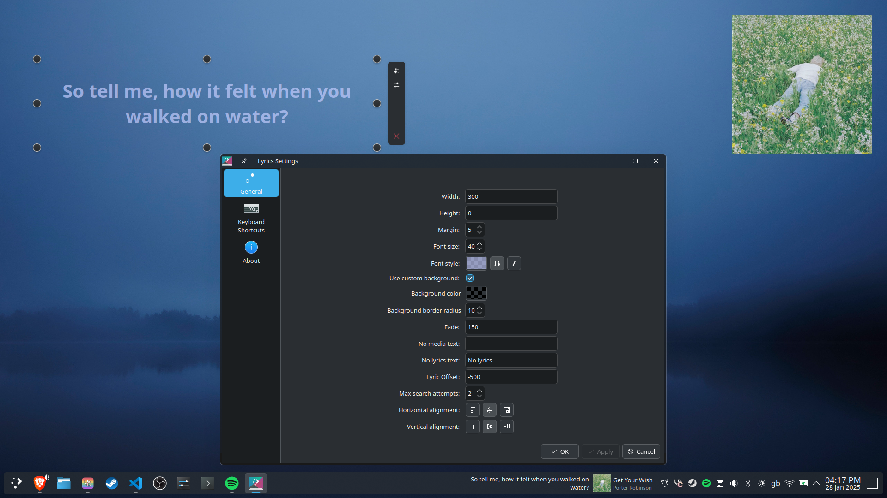
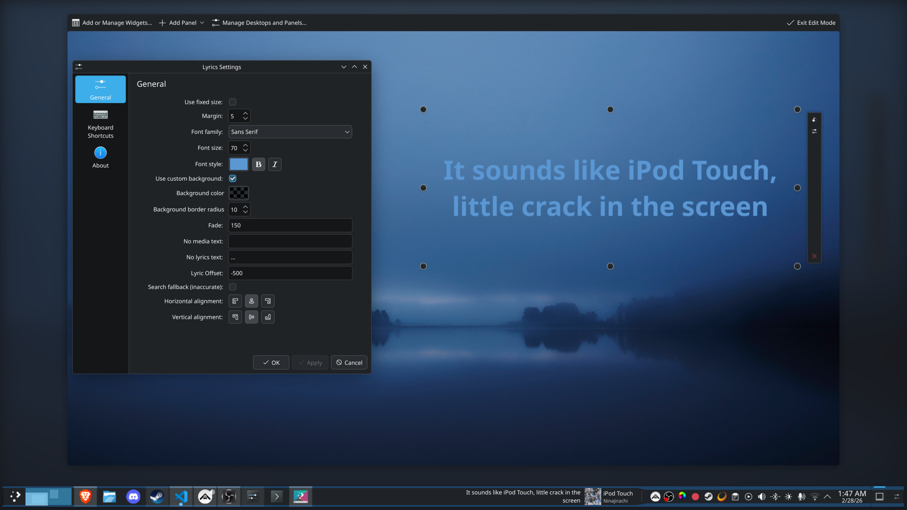
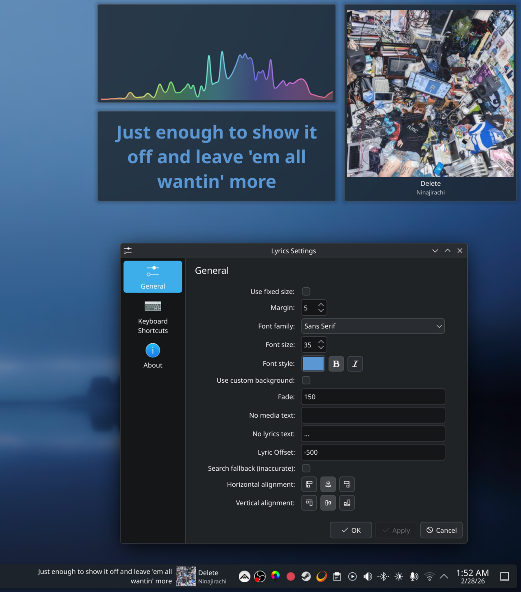

# Plasma Lyrics
Displays the lyrics of a song as a widget using [LRCLIB](https://lrclib.net)

Works with Spotify, YouTube, SoundCloud and everything else

## Installation
You can download the applet from the [KDE Store](https://store.kde.org/p/2349929) or by running `git clone https://github.com/Lyall-A/Plasma-Lyrics && cd Plasma-Lyrics && ./install.sh`

## Screenshots

